<table>
  <tr>
    <td align="center" width="400">
      
    </td>
    <td align="center" width="540">
      
    </td>
  </tr>
</table>

 

<h1 align="center">Hi, I'm mas-rur 👋</h1>

  <!-- one-line tagline about what you do, e.g. "Backend engineer building fast, reliable APIs" -->

---

### 🧰 Tech Stack

  <!-- swap these for the badges that match your stack -->
  
  
  
  

### 📊 GitHub Stats

  
  

### 🔗 Connect

  <!-- replace # with your real links -->
  
  
  

